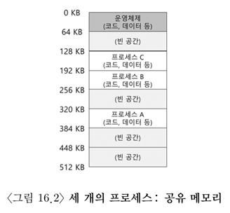
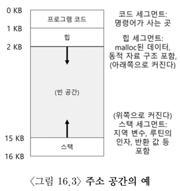

## 15장

  
<strong>가상 주소란 무엇인가요? 누가 누구에게 제공하나요?</strong>

 
  - 사용자 프로그램이 생성하는 모든 주소는 가상 주소이다. 
  - 운영체제가 각 프로세스에게 자신만의 전용 메모리를 가진다는 환상(가상 메모리)를 제공한다.
  - 운영체제는 하드웨의 도움을 얻어 가상 주소를 실제 물리 주소로 변환하고 원하는 데이터의 위치를 찾을 수 있다.  

  
<strong>운영체제는 왜 프로세스에게 가상 메모리를 제공하나요?</strong>

 
  - 사용하기 쉬운 시스템을 제공하기 위해서(운영체제는 각 프로세스에게 대용량의 연속된 주소공간을 가지고 있다는 시각을 제공, 그 결과 프로그래머가 변수를 어디에 저장해야 하는지 고민하지 않아도 괜찮다.)
  - 고립과 보호(잘못된 프로그램이 다른 프로그램의 메모리를 읽고, 수정하는 것을 막기 위하여)

 

## 16장

 

### 16.1 초기 시스템

  
<strong>초기 시스템의 메모리 구조는 어떻게 구성되어있나요?</strong>

 
  * 초기 메모리는 0부터 64KB까지 운영체제(루틴(라이브러리)의 집합)가 존재하였고 이후 나머지 모든 메모리는 하나의 프로그램이 사용하였다.
 
  

 

### 16.2 멀티프로그래밍과 시분할

  
<strong>멀티프로그래밍에서 운영체제의 역할은 무엇인가요?</strong>

 
  * 여러 프로세스가 실행 준비 상태에 있고 운영체제는 프로세스르들을 전환하며 실행하는 역할을 수행한다.
  * CPU의 이용률을 높여 효율성을 높이는 것이 운영체제의 역할이다.

  
<strong>초기 시분할은 어떻게 운영되었으며 단점은 무엇인가요?</strong>

 
  * 하나의 프로세스를 짧은 시간동안 실행시킨다.
  * 해당 기간동안 프로세스에게는 모든 메모리를 접근할 권한이 주어진다.
  * 이후 프로세스를 중단하고, 중단 시점의 상태를 디스크에 저장한다.
  * 메모리 내용전체를 디스크에 저장하다보니 느리게 동작하는 문제가 존재하였다.

  
<strong>시분할 시스템에서 물리 메모리는 어떻게 구성되나요? 그리고 각 프로세스는 어떻게 운영되나요?(A,B,C 세 개의 프로세스가 있다고 가정)</strong>

 
  * 각 프로세스는 물리 메모리에서 작은 부분들을 할당받는다.
  * 운영 체제가 선택한 프로세스는 실행되고 나머지 프로세스들은 준비 큐에서 실행을 기다린다.

 
  

  
<strong>여러 프로세스가 하나의 메모리를 공유하면서 어떠한 문제점이 대두되었나요?</strong>

 
  * 한 프로세스가 다른 프로세스를 읽거나 수정을 방지하는 보호(protection)가 중요 문제가 되었다.

 

### 16.3 주소 공간

  
<strong>주소공간의 코드, 스택, 힙은 무엇이고 어디에 저장되나요?</strong>

 
  * 코드(code, 명령어)는 반드시 메모리에 존재해야하며, 코드는 정적이어서 저장이 쉽\다. 그리고 코드는 주소공간의 상단에 배치하고 추가적인 메모리를 요구하지 않는다.
  * 스택은 함수 호출 체인 상의 현재 위치, 지역 변수, 함수 인자와 반환 값 등을 저장하는데 사용한다. 스택은 주소공간의 끝단에 저장되고 위로 확장된다.
  * 힙은 동적으로 할당되는 메모리에 사용되며, 코드 바로 아래에 위치해 아래 방향으로 확장한다.

 
  

  
<strong>프로세스가 가상 주소를 요청하면 운영체제는 어떻게 메모리를 불러오나요?(프로세스 A가 주소 0으로부터 데이터를 불러온다고 가정하고 설명할 것, A의 위치는 320KB에 위치)</strong>

 
  * 프로세스 A가 주소 0으로부터 load 연산을 수행할 때, 운영체제는 하드웨어의 지원을 통해 물리 주소 0이 아니라 물리주소 320KB, 즉 A가 탑재된 메모리를 읽도록 보장해야 한다.

 

### 16.4 목표

  
<strong>가상 메모리의 목표 중 하나인 투명성(transparency)을 설명하세요.</strong>

 
  * 프로그램은 메모리가 가상화 되었다는 사실을 인지해서는 안되는 것이 투명성이다. 오히려 프로그램은 자신이 전용 물리 메모리를 소유한 것처럼 행동하여 많은 작업들이 메모리를 공유할 수 있도록 해야한다.

  
<strong>가상 메모리의 목표 중 하나인 효율성(effciency)을 시간과 공간의 측면으로 설명하세요.</strong>

 
  * 운영체제는 가상화가 시간과 공간의 측면에서 효율적이도록 해야 한다. 시간적으로는 프로그램이 너무 느리게 실행되지 않도록 해야하며, 공간적으로는 가상화를 지원하기 위한 구조를 위해 너무 많은 메모리를 사용해서는 안된다. 시간-효율적인 가상화를 구현하기 위해서는 하드웨어의 지원을 받아야한다.

  
<strong>가상 메모리의 목표 중 하나인 보호(protection)을 설명하세요.</strong>

 
  * 운영체제는 프로세스를 다른 프로세스로부터 보호해야 하고 동시에 운영체제도 프로세스로부터 보호해야한다. 프로세스가 실행할 때 어떤 방법으로든 다른 프로세스나 운영체제의 메모리 내용에 접근하거나 영향을 주어서는 안되는 것이 보호의 원칙이고 보호를 통해서 프로세스를 고립할 수 있다.

  
<strong>보호와 관련된 고립(isolate)에 대해서 자세히 설명하세요</strong>

 
  * 고립은 신뢰할 수 있는 시스템을 구축하는데 중요한 원칙이다. 두 개체가 서로 적절하게 고립된 경우, 한 개체가 실패하더라도 상대 개체에 아무 영향을 주지 않는다는 것을 암시한다. 더 나아가 메모리 고립을 사용하여 운영체제는 프로그램이 운영체제 동작에 영향을 줄 수 없다는 것을 보장한다.
  * 현대의 운영체제는 고립을 더 확장하여 운영체제의 구성 요소를 고립시킨다. 마이크로 커널은 전통적인 모놀리식 커널보다 더 큰 신뢰성을 제공한다.

 

## 17장

 

### 17.1 메모리 공간의 종류

  
<strong>C프로그램이 실행되었을 때 할당되는 두 가지 유형의 메모리는 무엇인가요?</strong>

 
  * 첫 번째 유형의 메모리는 스택 메모리라고 불리며 프로그래머를 위해서 컴파일러에 의해 암묵적으로 할당과 반환이 이루어집니다. 프로그래머가 직접 할당과 반환을 하지 않기 때문에 자동 메모리라고 불리며, 유지되어야 하는 정보는 저장하지 않는 것이 좋습니다.
  * 두 번째 유형의 메모리는 힙 메모리라고 불리며 모든 할당가 반환이 프로그래머에 의해서 명시적으로 이루어집니다.

 

### 17.2 malloc() 함수

  
<strong>malloc()함수의 호출 구조를 설명하세요</strong>

 
  * 힙에 요청할 공간의 크기를 인자로 넘겨주면 성공했을 경우 새로 할당된 공간에 대한 포인터를 사용자에게 반환하고 실패했을 경우 NULL을 반환합니다.

 

### 17.3 free() 함수

  
<strong>free()함수의 호출 구조와 역할을 설명하세요</strong>

 
  * malloc()함수에 의해 반환된 포인터를 인자로 전달하면 할당된 메모리를 해제한는 역할을 수행한다.

 

### 17.4 흔한 오류

  
<strong>malloc과 free를 사용하는 과정에서 흔히 발생하는 오류 2가지 이상 설명하세요</strong>

 
  * 메모리 할당 잊어버리기 : 코드 작성중 메모리를 할당하지 않고 프로그램을 실행할 경우 세그멘테이션 폴트(segmentation fault)가 발생할 가능성이 높다.
  * 메모리 부족하게 할당받기 : 필요한 공간보다 부족하게 메모리를 할당받는 것을 의미하며 버퍼 오버플로우라고도 불린다.
  * 할당 받은 메모리 초기화하지 않기 : malloc()은 제대로 호출했지만 새로 할당받은 데이터 타입에 특정 값을 넣는 것을 의미하며, 초기화하지 않는다면 프로그램은 결국 초기화되지 않은 읽기(uninitialized read)를 하게 된다.
  * 메모리 해제하지 않기 : 메모리 누수가 일어나게 되는 오류이다. 장시간 실행되는 프로그램에서는 더욱 중요한 요소이며, 프로그래머는 메모리 청크의 사용이 끝나면 반드시 해제해야 한다.
  * 메모리 사용이 끝나기 전에 해제하기 : 프로그램이 메모리 사용이 끝나기전 해제를 하는 것을 의미하며, dangling pointer라고도 불린다. 해당 포인터를 사용하게 된다면, 크프로그램은 크래시를 시키거나 메모리 영역을 덮어서 사용한다.
  * 반복적으로 메모리를 해제하기 : 이미 한번 해제된 메모리를 또 해제하는 것을 의미하며 이중 해제(double free)라고도 불린다. 가장 흔하게는 크래시가 일어나지만 예상치 못하는 오류들이 일어날 가능성이 높아 조심하여야 한다.
  * free()잘못 호출하기：free에게 malloc을 통해서 받은 인자가 아니라 다른 값을 전달할 때 발생하는 오류로 유효하지 않은 해제(Invalid free)가 일어나며 예측 불허한 에러가 나게 된다.

 

  
<strong>프로세스를 종료하였을 때 메모리 누수가 발생하나요?</strong>

 
  * 시스템이 두 단계로 메모리를 관리하기에 메모리 누수가 발생하지 않습니다. 프로세스 단에서 free를 호출하지 못하였더라도 운영체제가 프로세스가 사용한 모든 메모리를 회수하기 때문에 메모리 누수가 발생하지 않습니다. 그러나 장시간 실행되는 프로그램에서는 프로세스가 종료될일이 많지 않으므로 메모리 누수의 문제를 중요시 해야합니다.

 

### 17.6 기타 함수들

  
<strong>calloc()과 realloc()의 차이를 설명해주세요</strong>

 
  * calloc은 메모리의 할당 영역을 0으로 채워서 반환하는 함수로 초기화를 잊지 않도록 방지해주는 역할을 수행한다.
  * realloc()은 추가적인 메모리 할당이 필요할 때 더 큰 새로운 영역을 확보하고, 옛 영역의 내용을 복해서 새 영역의 포인터를 반환하는 역할을 수행합니다.

